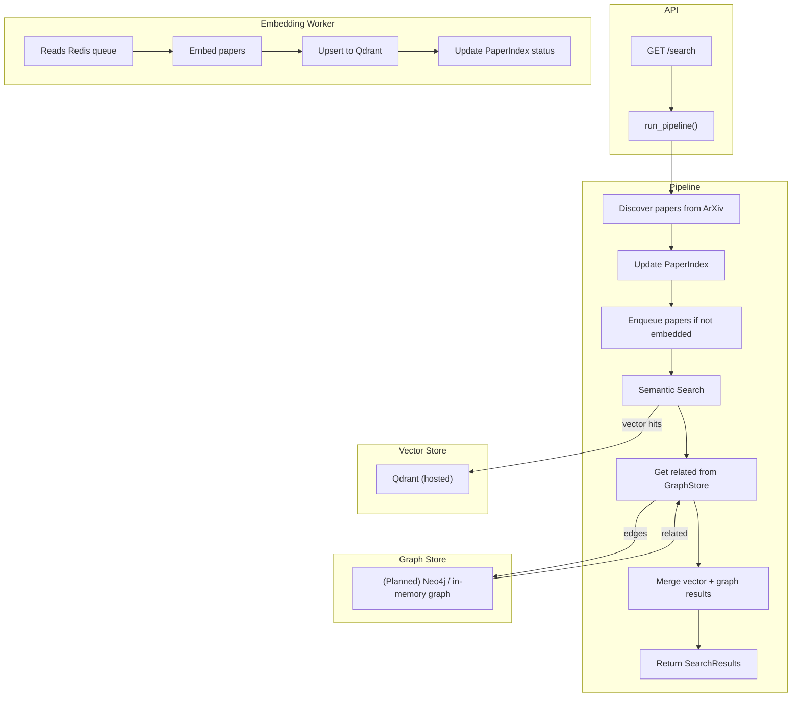

# graph-rag

A modular AI pipeline that fetches research papers from ArXiv, tracks their ingestion state, and queues them for embedding and indexing into Qdrant. Designed for scalable semantic + graph-augmented search (Graph-RAG).




## Features

- 📄 Fetch papers from ArXiv API
- 🧠 Queue papers for embedding (deferred, async)
- 🧮 Track paper ingestion state in SQLite index
- 📦 Index embeddings into Qdrant
- 🔍 Search Qdrant with fastembed support
- 🧩 Merge vector + (planned) graph hits
- ✅ Type-safe, testable, modular pipeline
- ⚙️ Health checks, typed interfaces, and task runner setup

## Usage

```bash
poe server     # Run the FastAPI backend
poe pipeline   # Run the end-to-end pipeline (logs steps)
poe test       # Run the tests
```

## TODO

- [x] Fetch papers from ArXiv API  
- [x] Parse + normalize metadata (title, abstract, authors, etc.)  
- [x] Implement `PaperIndex` to track ingestion state  
- [x] Add Redis-backed embedding queue  
- [x] Add `enqueue_missing()` to dedupe and defer processing  
- [x] Write unit tests for queuing logic  
- [x] Add semantic search using Qdrant fastembed  
- [x] Modularise pipeline into discovery, semantic, queue  
- [x] Add structured, typed `IngestEvent` system  
- [x] Return semantic search results via `/search`  
- [x] Deploy Qdrant to Fly.io  
- [x] Support `poe` task runner for DX  
- [ ] Implement embedding worker to consume queue and upsert to Qdrant  
- [ ] Track paper status post-embedding in `PaperIndex`  
- [ ] Implement `GraphStore` backend (e.g., NetworkX or Neo4j)  
- [ ] Define and compute paper "relatedness" (authors, topics, citations, etc.)  
- [ ] Add logic to update graph with related nodes  
- [ ] Fuse graph + vector results in `core.search()`  
- [ ] Handle papers with missing metadata gracefully  
- [ ] Add ranking logic to `SearchResult`  
- [ ] Build CLI or frontend for querying + graph viz  
- [ ] Populate Qdrant on startup (bootstrap/init script)  
- [ ] Deploy backend to Fly.io or similar  
- [ ] Snapshot Qdrant or add B2 backup support  
- [ ] Add metrics, health checks, and logging to pipeline  
