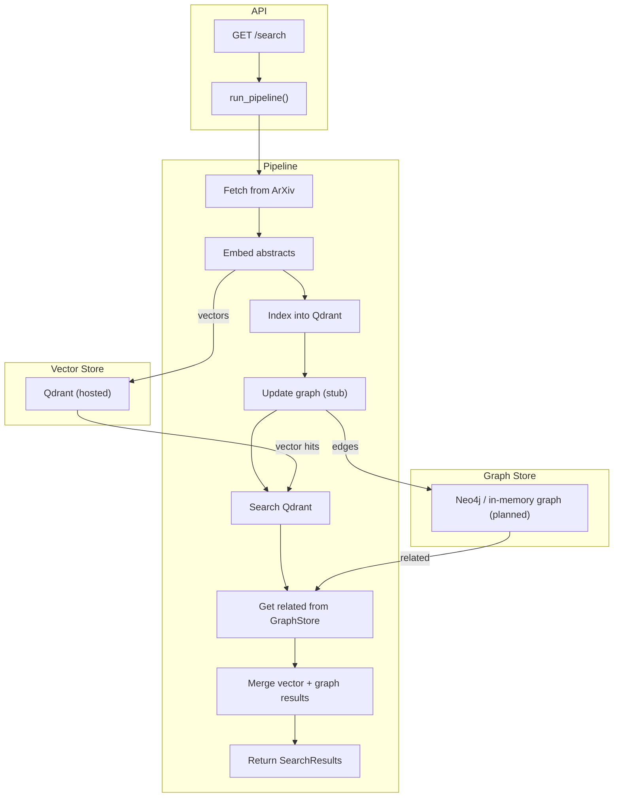

# graph-rag

An AI pipeline that fetches research papers from ArXiv, embeds them using `sentence-transformers`, and indexes them into a Qdrant vector store for semantic search. The pipeline is designed to be modular and extensible, allowing for easy integration with various backends and search interfaces.



## Features

- 📄 Fetch papers from ArXiv API
- 🧠 Embed abstracts with `sentence-transformers`
- 📦 Index embeddings into Qdrant
- 🔍 Perform semantic search (with placeholder graph hooks)
- ⚙️ Health checks, typed interfaces, and task runner setup

## Usage

```bash
poe server     # Run the FastAPI backend
poe pipeline   # Run the end-to-end pipeline (logs steps)
poe test       # Run the tests
```

## TODO

- [x] Fetch papers from ArXiv API  
- [x] Embed abstracts using `sentence-transformers`  
- [x] Index vectors into Qdrant  
- [x] Deploy Qdrant to Fly.io  
- [x] Return semantic results via `/search`  
- [x] Modular backend with typed pipeline events  
- [ ] Implement real `GraphStore` backend  
- [ ] Define what makes papers “related” (shared authors, topics, LLM tags, etc.)  
- [ ] Fuse graph + vector results in `core.search()`  
- [ ] Add "merge" step to combine graph and vector hits  
- [ ] Populate Qdrant on startup (bootstrap script or init route)  
- [ ] Patch arXiv parsing for missing fields  
- [ ] Add scoring + ranking to `SearchResult`  
- [ ] Write test for pipeline + core logic  
- [ ] Build CLI or frontend for querying + graph viz  
- [ ] Deploy backend (Fly.io or similar)  
- [ ] Add structured logging for events + errors  
