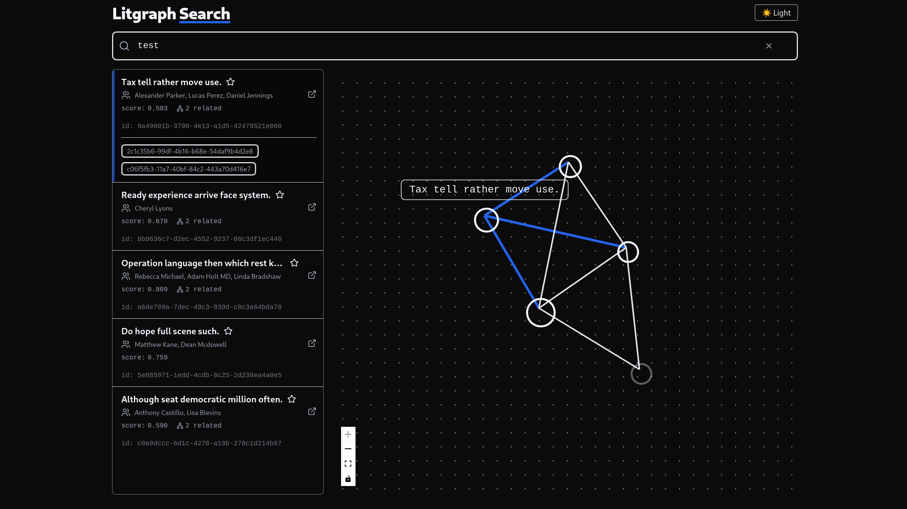
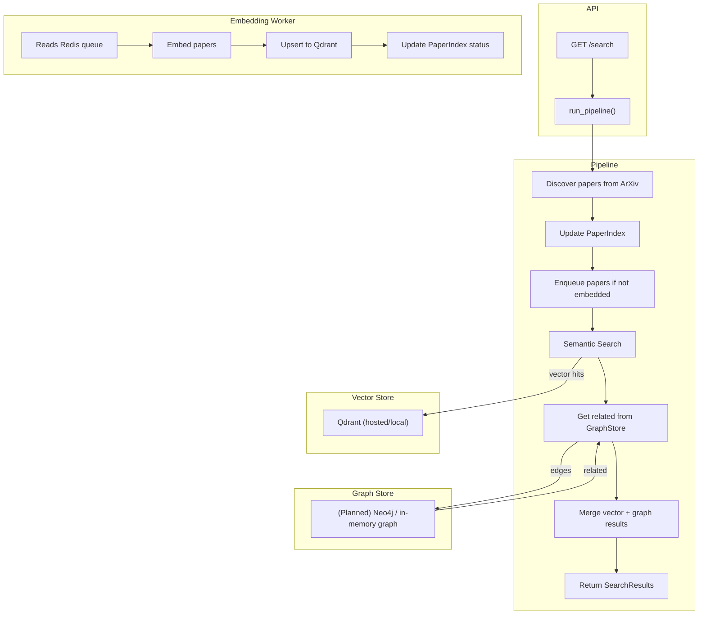

# Litgraph

Graph-augmented semantic search for academic literature

<p align="center">
  
  <br/>
  <em>Frontend: semantic results + graph view (mock data)</em>
</p>

## Features

- 📄 Fetch papers from ArXiv API
- 🧠 Queue papers for embedding (deferred, async)
- 🧮 Track paper ingestion state in SQLite index
- 📦 Index embeddings into Qdrant
- 🔍 Search Qdrant with fastembed support
- 🧩 Merge vector + (planned) graph hits
- ✅ Type-safe, testable, modular pipeline
- ⚙️ Health checks, typed interfaces, and task runner setup

## Usage

### Requirements

- Python 3.12+
- Node.js 20+
- Docker + Docker Compose

### Local dev (CPU by default)

```bash
make up-full        # Run full stack with CPU
make up-full USE_GPU=1  # Run with GPU (requires NVIDIA runtime)
```

Services:

- **API** → [http://localhost:8000/docs](http://localhost:8000/docs)
- **Qdrant UI** → [http://localhost:6333/dashboard](http://localhost:6333/dashboard)
- **Redis** → localhost:6379 (use `redis-cli`)

### Direct tasks (no Docker)

```bash
poe server     # Run the FastAPI backend
poe pipeline   # Run the end-to-end pipeline (logs steps)
poe test       # Run the tests
```

## Diagram

<details>
<summary>System architecture diagram</summary>



</details>

Stack highlights:

- Backend: FastAPI + Pydantic + Poetry (with `poethepoet` task runner)
- Queue: Redis (Upstash or local)
- Vector DB: Qdrant
- Frontend: React + Vite + Tailwind
- Infra: Docker Compose + Fly.io

## Acknowledgements

Thank you to arXiv for use of its open access interoperability.

## License

MIT
